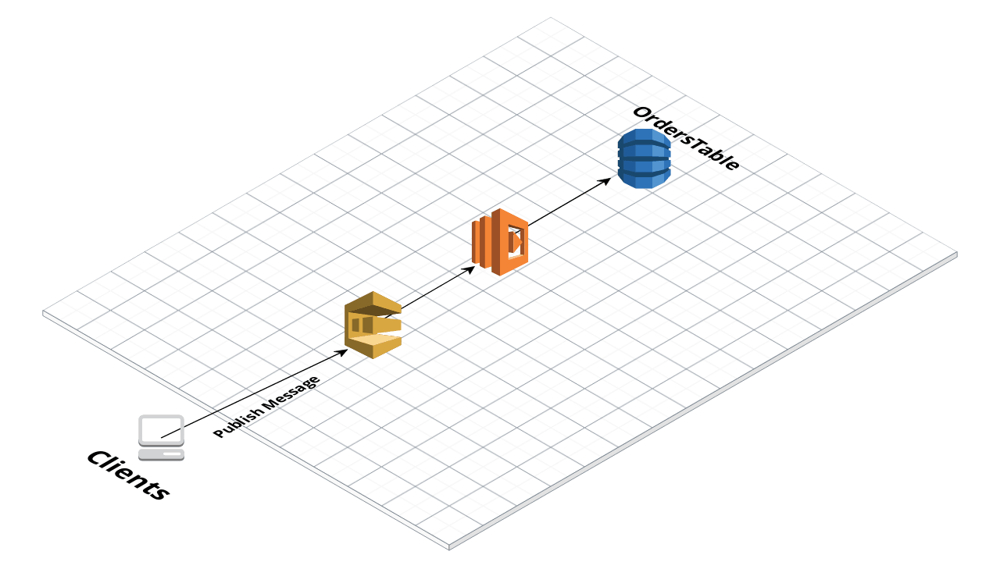

## SQS Lambda and DynamoDB Stack
This example will deploy a SQS queue, a DynamoDB table and a Lambda function written in Javacript. Lambda function will get triggered by incoming SQS messages. It will process the incoming message and processed data will be added to DynamoDB table.



You will see a SQS URL after the successful deployment. Use `aws-cli` to send basic message for testing the CDK Stack.

```
aws sqs send-message --queue-url https://sqs.us-west-1.amazonaws.com/[ACCOUNT_ID]/Orders --message-body "{\"items\": [\"coffee\", \"gum\"], \"customerId\": \"qm1h324k\"}" --delay-seconds 2 --profile your_profile --region us-west-1
```

You should be seeing the new item in DynamoDB table.