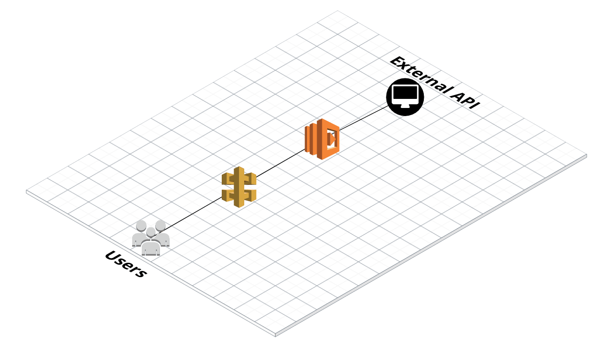

## Lambda API Gateway
This example will deploy a Lambda function written in Python and API Gateway with one resource. Lambda function will return one random poem from external API (http://poetrydb.org) as a JSON response.

After the successful deployment you will get an url similiar to this.

`https://ygnbp5okp4.execute-api.us-west-1.amazonaws.com/prod/`

Append `poems` to this url and try to reach it. You'll get a poem with details as a JSON response.